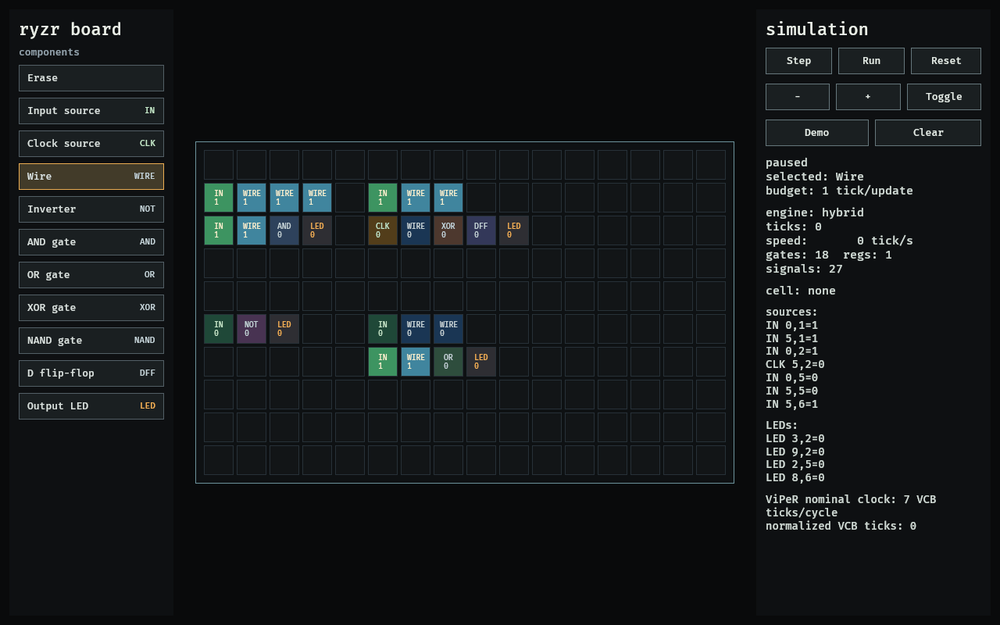
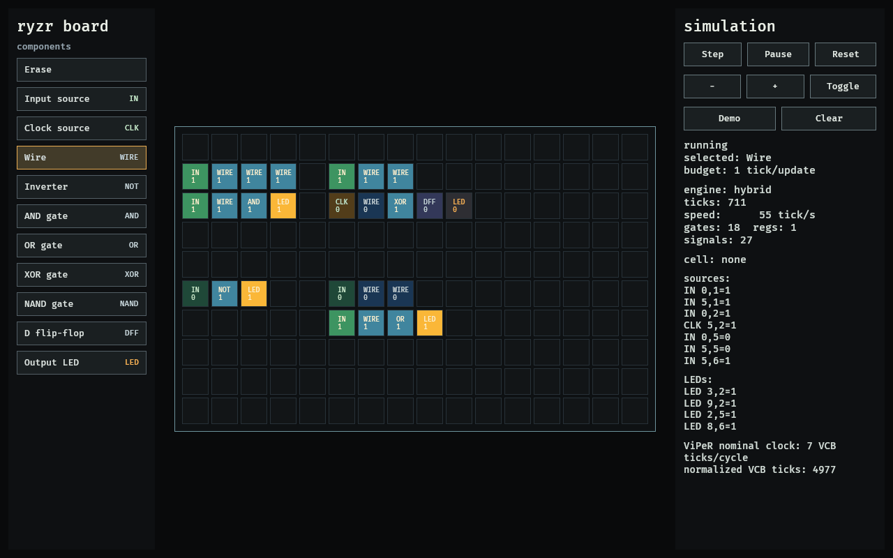

# ryzr

Blazingly fast digital logic simulation engines for VCB-like games.

The rule that everything here obeys: **simulation is honest**. If a user
builds an adder out of gates, every bit of that adder is actually computed,
every tick. Engines are free to be clever about *how* values are computed —
never about *whether* they are. All engines produce bit-for-bit identical
results to a naive reference interpreter, and the test suite enforces it.

## Workspace

| crate | purpose |
|---|---|
| `ryzr-core` | circuit IR, builder, topological sort, reference interpreter (the oracle) |
| `ryzr-backend` | the single-instance engines, one compiled tape |
| `ryzr-riscv` | gate-level RV32I core: the honesty benchmark |
| `ryzr-gui` | Bevy 0.18 VCB-like matrix editor for stepping circuits on the `ryzr` runtime |

## Engines

Every engine consumes the same compiled tape: the circuit levelized,
sorted by `(level, op)` into homogeneous runs, and laid out as
struct-of-arrays with pre-validated operand indices (no bounds checks in
the hot loop, no `unsafe` without a compile-time-established contract).

Every engine here simulates a **single** circuit instance. The goal is the
fastest one machine and the richest feedback at low speeds (highlighting
which wires switch each tick) — not aggregate throughput over many
independent copies, which a circuit game never needs.

| engine | strategy |
|---|---|
| `ScalarEngine` | dense forward pass, one dispatch per run instead of per gate |
| `EventEngine` | recomputes only the cone affected by actual changes |
| `PackedEngine` | one instance bit-packed: up to 64 same-op gates per word op (SWAR within the circuit), ripple-carry chains fused into native adds |
| `PackedJitEngine` | the packed plan compiled to native code via Cranelift — the fastest single-instance engine |
| `ThreadedEngine` | wide levels fanned out across cores via rayon |
| `HybridEngine` | the winning set behind one type — the one that rules them all |

### Packed: SWAR for a single circuit

Word-level parallelism normally comes from running 64 *copies* — useless
when you care about one machine. `PackedEngine` turns the trick inward:
every signal of one instance occupies one bit of a `u64` arena, and because
the tape sorts each level into homogeneous op runs, one word op evaluates up
to 64 *different gates of the same kind* at once.

The catch is that those 64 gates read from 64 scattered bit positions, and
a gather per operand would eat the win. So gathers are compiled, not
interpreted: at construction, the execution graph is analyzed per output
word and each one gets the cheapest program that assembles its operands —
constants fold to an immediate (free), operands that sit contiguously in
source order stream through a funnel shift (~6 ops for up to 64 bits), and
the scattered remainder is filled by masked splats. A tick then replays
straight-line word ops with no per-gate branching at all.

The plan also recognizes structure the user built out of gates. Ripple
adder and incrementer chains — the textbook xor/and/or full-adder lattice —
are detected in the gate graph and fused: an entire carry chain of up to
63 bits becomes one native 64-bit add whose sum bits *are* the chain's sum
gates and whose top bit is the carry-out. This is not an abstraction
shortcut — the add computes the exact same boolean functions the gates
declare, bit for bit, and the differential suite proves it. On the RV32I
core, fusion absorbs ~480 gates into 4 adds.

`PackedJitEngine` then takes the same plan and compiles it to native code
with Cranelift: every gather offset and mask baked in as an immediate,
word values flowing through registers instead of the arena. It is the
fastest way here to simulate one machine.

### The hybrid engine

`HybridEngine` is the answer to "which engine should I use?" — it doesn't
guess, it measures. At construction it builds every plan that can serve
the request, times each for a fraction of a millisecond *on the live
circuit*, keeps the winner, and resets it to power-on state. Either way
the results are bit-for-bit identical; only the speed differs.

- **`HybridEngine::new`** accelerates a single instance: it races
  `PackedJitEngine`, `PackedEngine`, `EventEngine`, and `ThreadedEngine`.
  The winner depends on real circuit properties — the packed JIT wins on
  dense always-active logic, event on mostly-idle circuits, threaded on
  very wide levels.

## The honesty benchmark: a RISC-V processor made of gates

`ryzr-riscv` builds a single-cycle RV32I core from nothing but `ryzr`
gate primitives — ripple-carry ALU, barrel shifters, register file and
RAM as D flip-flops behind mux trees, ROM as combinational mux trees.
With 256 words of RAM that is **22,679 gates and 9,216 flip-flops across
88 logic levels**, and one engine tick retires exactly one instruction.

Correctness is not asserted, it is *proven in lockstep*: tests run the
gate-level circuit against an instruction-level emulator and compare the
full architectural state — pc and all 32 registers — after every retired
instruction, across arithmetic, branch, and memory test programs, plus
end-to-end results (`fib(20) = 6765` computed by actual gates). CI runs
the same lockstep suite in release mode on the exact binaries it then
benchmarks.

Representative numbers from a 6-core desktop (`fib` loop;
1 tick = 1 retired instruction):

| engine | throughput | what it simulates |
|---|---|---|
| event | ~16 K instr/s | one CPU |
| scalar | ~47 K instr/s | one CPU |
| packed | ~337 K instr/s | one CPU |
| **packed-jit** | **~1.49 M instr/s** | **one CPU** |
| hybrid | ~1.37 M instr/s | one CPU |

The single-CPU number is the honest headline: the packed JIT retires
~1.49 M instructions/s on one simulated machine — ~32× the scalar pass —
winning the race on this circuit (carry-chain fusion, RAM- and
register-file read fusion, SWAR packing and native code, compounding).
Every engine here drives
one machine; there is no aggregate-over-many-copies mode, because a circuit
game needs one fast instance, not 64 independent ones.

A note on comparing with Virtual Circuit Board numbers:
[vcb-riscv](https://github.com/WildDude7/VCB-RISCV) reaches ~1.1 M
*ticks*/s in VCB, but a VCB tick is a single signal-propagation step, not
a clock cycle — signals cross roughly one gate per tick, so one
instruction takes many ticks (an ALU adder alone costs about 7 ticks per
stage of carry). In `ryzr`, one tick settles the entire 88-level
combinational cone and latches every flip-flop: one tick = one full clock
cycle = one retired instruction. The two rates measure different things
and dividing VCB's tick rate by its ticks-per-instruction is the only
fair conversion. What `ryzr` keeps from VCB is the honesty: every gate is
computed every tick, nothing is abstracted away.

### Doom-like VCB comparison workload

For issue-to-issue comparisons with ViPeR/VCB, `ryzr-riscv` also includes
a deterministic RV32I "Doom-like" workload. It is not a renderer shortcut:
the program retires ordinary instructions for frame, ray, and step loops,
then leaves the result in architectural registers:

| register | meaning |
|---|---|
| `a0` / `x10` | checksum |
| `a1` / `x11` | completed frames |
| `a2` / `x12` | completed rays |
| `a3` / `x13` | synthetic wall-hit count |
| `a7` / `x17` | done flag |

The benchmark example runs the same instruction stream through every
`ryzr` engine, prints instructions/s and frames/s, and can emit a
ViPeR/VCB-compatible VMEM image:

```sh
cargo run -p ryzr-riscv --release --example doom_bench -- \
  --frames 180 \
  --emit-vcbmem target/doom_bench_180.vcbmem
```

Load the generated `.vcbmem` into the ViPeR/VCB RISC-V ROM path and run
until `a7 == 1`. The fair comparison target is the printed checksum and
counter tuple, not host-side drawing. The example also prints ViPeR's
nominal 7 VCB ticks/instruction cost, so a VCB run can be reported both
as raw VCB ticks/s and as equivalent retired instructions/s.

## Bevy matrix editor

`ryzr-gui` is a Bevy 0.18 application that opens directly into a VCB-like
2D component matrix. The board can be edited cell-by-cell with sources,
clock sources, wires, logic gates, D flip-flops, and LED probes. Every edit
rebuilds an actual `ryzr-core` circuit, and the simulation panel advances
that circuit through `ryzr-backend::HybridEngine` one clock cycle at a time
or at a chosen tick budget. Active cells are highlighted from live engine
outputs, so the editor is exercising the same runtime path as the backend
benchmarks rather than a separate toy simulator.

| Idle (paused) demo board | Live simulation (`Run`) |
| --- | --- |
|  |  |

The right panel reports the live engine name, tick count, measured
ticks/second, gate/register/signal counts, every source and LED probe, and
the normalized ViPeR/VCB clock cost so a board edited here can be compared
directly against the same circuit in VCB.

```sh
cargo run -p ryzr-gui --features fast-compile
```

The `fast-compile` feature enables Bevy's `dynamic_linking` feature for
shorter edit-run cycles. The root dev profile already strips dependency
debug info; for more aggressive local Bevy iteration, follow Bevy's setup
[guide](https://bevy.org/learn/quick-start/getting-started/setup/#enable-fast-compiles-optional)
for `lld`/`mold` or nightly Cranelift on machines where those tools are
installed.

Set `RYZR_GUI_AUTORUN=1` to launch the editor with the simulation already
running (useful for demos and headless screenshots).

## VCB comparison report

Use the same architectural signature on both sides. For the included
Doom-like workload, `doom_bench` prints the expected `a0` checksum,
completed frame/ray/hit counters in `a1`/`a2`/`a3`, the `a7` done flag,
retired instruction count, instructions/s, frames/s, and a VCB VMEM image:

```sh
cargo run -p ryzr-riscv --release --example doom_bench -- \
  --frames 180 \
  --emit-vcbmem target/doom_bench_180.vcbmem
```

Load the generated `.vcbmem` into the ViPeR/VCB VMEM path and run until
`a7 == 1`. Record the final `a0`, `a1`, `a2`, `a3`, and `a7` values, plus
VCB raw ticks or wall-clock time. A correct comparison first checks that
the signature tuple matches the `ryzr` output; only then compare speed.
`ryzr` reports one tick as one full CPU clock cycle / retired instruction.
ViPeR notes use a nominal 7 VCB signal ticks per CPU cycle, so report VCB
both as raw ticks/s and as equivalent retired instructions/s:

```text
equivalent_instr_per_sec = completed_instructions / elapsed_seconds
equivalent_instr_per_sec = raw_vcb_ticks_per_sec / measured_vcb_ticks_per_instruction
```

For another example program, keep the same structure: define a deterministic
done condition, write a checksum or signature to registers or memory, emit
the VMEM image, verify the signature in VCB, then normalize by completed
instructions rather than by host-side rendering or UI frame rate.

## Running it

```sh
cargo test --workspace            # oracle + differential + RISC-V lockstep
cargo bench -p ryzr-riscv         # instructions/sec on the gate-level core
cargo bench -p ryzr-backend       # synthetic microbenchmarks
cargo run -p ryzr-riscv --release --example stats   # circuit statistics
cargo run -p ryzr-riscv --release --example doom_bench -- --frames 180
cargo run -p ryzr-gui --features fast-compile
```

`ryzr-backend` features: `jit` and `rayon` are on by default; the crate
builds and passes its tests with `--no-default-features` (scalar, event,
and SWAR engines only).
